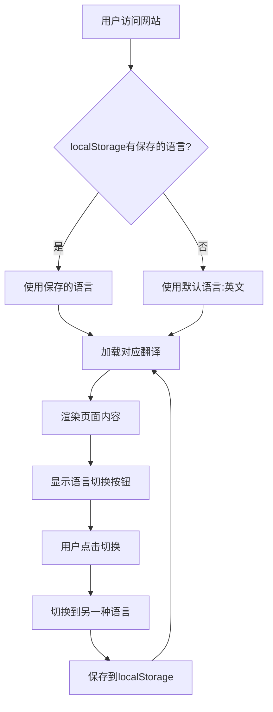

# 个人主页国际化（i18n）实现计划

## 概述

将个人主页改造为支持中英文双语版本，在页面右上角添加语言切换按钮，网址保持固定不变，使用localStorage记住用户的语言偏好，默认显示英文。

## 技术方案

### 架构设计



### 文件结构

```
personal-website/
├── index.html              # 主页面（添加data-i18n属性）
├── css/
│   └── style.css          # 添加语言切换按钮样式
├── js/
│   ├── main.js            # 主逻辑（集成i18n模块）
│   └── i18n/
│       ├── i18n.js        # 国际化核心逻辑
│       └── translations.js # 语言翻译配置
└── plans/
    └── i18n-implementation-plan.md
```

## 实现步骤

### 步骤1: 创建语言翻译配置文件

创建 [`js/i18n/translations.js`](js/i18n/translations.js) 文件，包含所有需要翻译的文本。

### 步骤2: 创建国际化核心逻辑

创建 [`js/i18n/i18n.js`](js/i18n/i18n.js) 文件，包含：
- 语言初始化（检查localStorage）
- 语言切换功能
- 翻译应用功能

### 步骤3: 修改HTML

在 [`index.html`](index.html) 中：
- 为需要翻译的元素添加 `data-i18n` 属性
- 在页面右上角添加语言切换按钮

### 步骤4: 添加CSS样式

在 [`css/style.css`](css/style.css) 中添加语言切换按钮样式。

### 步骤5: 更新main.js

在 [`js/main.js`](js/main.js) 中集成i18n模块。

## 语言切换按钮设计

```
┌─────────────────────────────────────────────────────┐
│                                              [EN/中文] │
│                                                     │
│              Junwen Gu | 顾俊文                       │
│                                                     │
│              [个人简介内容...]                         │
│                                                     │
└─────────────────────────────────────────────────────┘
```

按钮样式：
- 位置：右上角固定
- 样式：简洁的切换按钮，显示当前可切换到的语言
- 交互：点击立即切换，无需刷新页面

## 需要翻译的内容清单

### 1. 页面元信息
- meta description
- meta keywords

### 2. 头部区域
- 个人简介段落1（约100字）
- 个人简介段落2（约80字）

### 3. 教育背景
- 章节标题：Education / 教育背景
- 学位名称（如 PhD, BE）
- 荣誉信息描述

### 4. 研究区域
- 章节标题：Research / 研究工作
- 说明注释：* indicates equal contribution...
- 子章节标题：First-Author Publications / 第一作者论文
- 子章节标题：Co-authored Publications / 合作论文

### 5. 论文摘要（需要翻译）
- TRO论文摘要
- USIM/U0论文摘要
- CBS 2024论文摘要
- TIE论文摘要
- ICCSS 2021论文摘要

### 6. 链接文本
- Paper / 论文
- Project Page / 项目主页
- 中文介绍（保持不变）

### 7. 页脚
- 版权信息
- 最后更新时间

## 不翻译的内容

1. **论文标题**：学术论文标题保持原文
2. **作者姓名**：保持原格式
3. **期刊/会议名称**：保持原文
4. **机构名称**：如CASIA、USTB保持原文
5. **人名**：如导师、合作者姓名

## 实现细节

### data-i18n属性使用示例

```html
<!-- 文本内容翻译 -->
<h2 class="section-title" data-i18n="education_title">Education</h2>

<!-- 属性翻译（如placeholder、title） -->
<input data-i18n-placeholder="search_placeholder">

<!-- HTML内容翻译 -->
<p data-i18n-html="bio_p1">I am a Ph.D. candidate...</p>
```

### 翻译文件结构示例

```javascript
const translations = {
    en: {
        education_title: "Education",
        research_title: "Research",
        // ...
    },
    zh: {
        education_title: "教育背景",
        research_title: "研究工作",
        // ...
    }
};
```

## 测试计划

1. ✅ 首次访问默认显示英文
2. ✅ 点击按钮切换到中文
3. ✅ 再次点击切换回英文
4. ✅ 刷新页面后语言保持
5. ✅ 关闭浏览器重新打开，语言保持
6. ✅ 所有文本正确翻译
7. ✅ 页面布局不受影响
